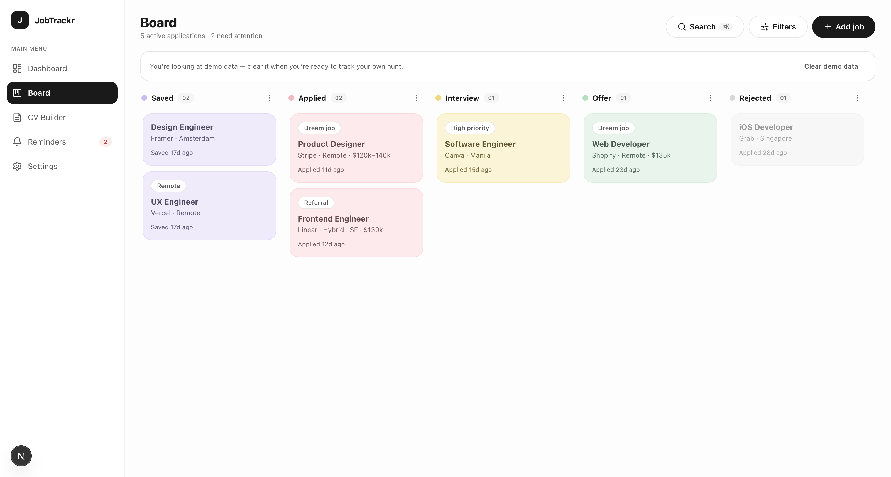

# JobTrackr

A beautiful job-hunt tracker: a pastel kanban pipeline, follow-up nudges,
interview tracking, insights, and a built-in CV builder. Your data stays in
your browser, scoped to your account — sign in from another device and it
isn't there; that's by design, cloud sync is next.

**[Live demo →](https://jobtrackr-9mqd.vercel.app)**



## Getting started

JobTrackr needs a Supabase project for authentication:

1. Create a project at [supabase.com](https://supabase.com).
2. Copy `.env.example` to `.env.local` and fill in the URL and anon key from
   **Project Settings → API**.
3. In **Authentication → Providers**, keep Email enabled. In
   **Authentication → Rate limits**, set explicit per-hour limits for sign-in
   attempts and transactional email rather than leaving the defaults.
4. Set a spend cap and billing alert under **Organization → Billing** before
   deploying publicly.
5. `npm install && npm run dev`

No account needed to look around — the sign-in page has an **Explore the demo**
link that opens the app with a full sample dataset, stored only in your browser.

## Features

- **Board** — pastel kanban pipeline with pointer-accurate drag-and-drop across
  stages, editable columns, and per-application detail with buffered save (edits
  commit only when you choose, so nothing is lost by accident).
- **Reminders** — follow-up nudges after N days of silence and interview tracking.
- **Dashboard** — response rate, interview conversion, and other insights across
  your applications.
- **CV builder** — a master profile you edit once, then spin off tailored versions
  per role; three templates (Classic, Modern, Elegant) with a live A4 preview that
  re-renders as you type, and one-click client-side PDF export. Each CV links back
  to its application, so every job carries its documents.

Built desktop-first with responsive support, and to WCAG 2.1 AA — full keyboard
operation, visible focus, live-region status, and audited contrast.

## Stack

Next.js 16 · TypeScript · Supabase (auth) · Tailwind 4 · Zustand ·
Dexie (IndexedDB) · dnd-kit · Motion · Recharts. Tested with Vitest + Testing
Library and Playwright.

## Develop

```bash
npm install
npm run dev        # http://localhost:3000
npm test           # unit tests (Vitest)
npm run e2e        # smoke + auth tests (Playwright)
npm run build      # production build
```

`.env.local` (see **Getting started** above) is required before `npm run dev`
or the Playwright suite will boot — every route, including the demo path,
runs behind middleware that needs a configured Supabase project.

## Roadmap

- **Phase 3** — Cover Letter Generator (reuses the CV template system, tied to
  each application).
- **Phase 4** — AI: CV bullet-point polishing and cover-letter drafting via a
  rate-limited backend endpoint.
- **Now** — accounts with per-device data isolation. Cloud sync is next.
- **Later** — dark mode, PWA install.
